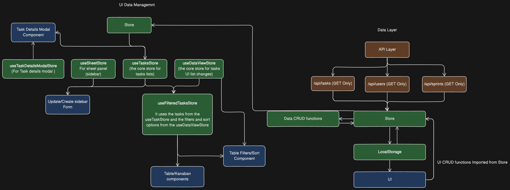

## Overview
Task Management app support 2 views Table/Kanban, Have filters, sorting, dark/light theme, custom columns / fileds

App Link: https://task-management-seven-chi.vercel.app/

## Design decisions


Diagram online link: https://app.eraser.io/workspace/piySng7PGRpGW188G47G

## Implemented Features
- Core/Bonus Milestones
- Add Custom field for each task
- Assigned Sprints/Users for each task
- Dark/Light Theme
- Task Details modal
- Task decription controls
- Direct task edit by access link with task query include the task id `?task={ID}`

## Install

First, run the installation:

```bash
npm i
# or
yarn
```

Then, run the development server:

```bash
npm run dev
# or
yarn dev
```

Open [http://localhost:3000](http://localhost:3000) with your browser to see the result.